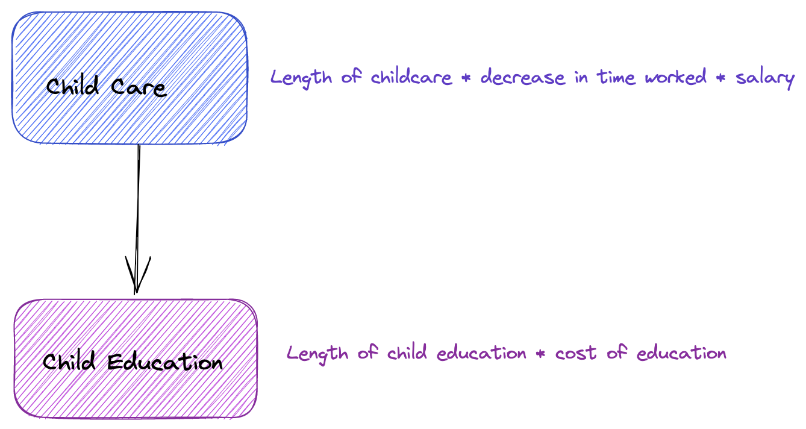
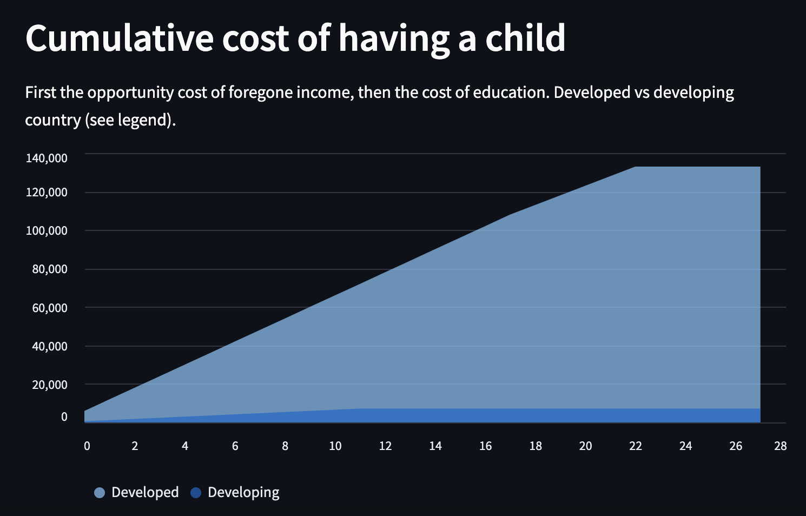

# Cost of having a child

Interactive Explainer of the cost of child and how the calculation differs between a developing and a developed country.
Inspired by video from [Economics Explained](https://www.youtube.com/watch?v=YYvLEbC3kn8&t=76s)

See it deployed [here](https://costofchild-f3grxgsxra-ew.a.run.app)

